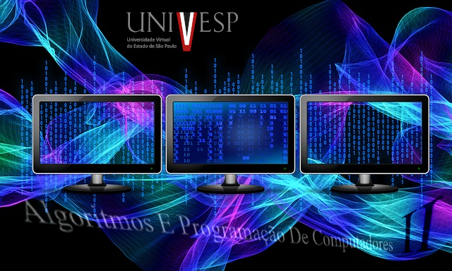

# Algoritmos e Programação de Computadores II

 

* Semana1 => Arquivos e depuração
* Semana2 => Poo e modularização
* Semana3 => Recursão
* Semana4 => Pilhas, filas e árvores
* Semana5 => Ordenação e busca
* Semana6 => Elementos Web
* Semana7 => GUI
* Semana8 => Git e testes

 

